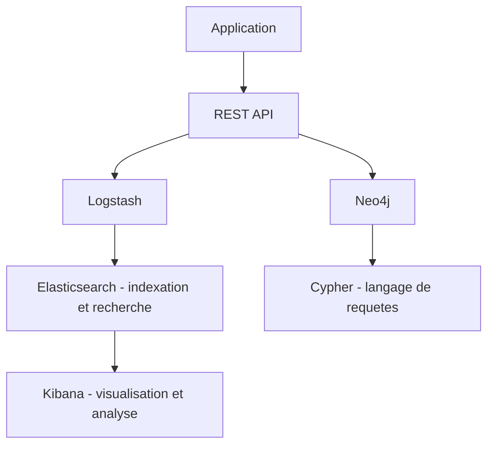
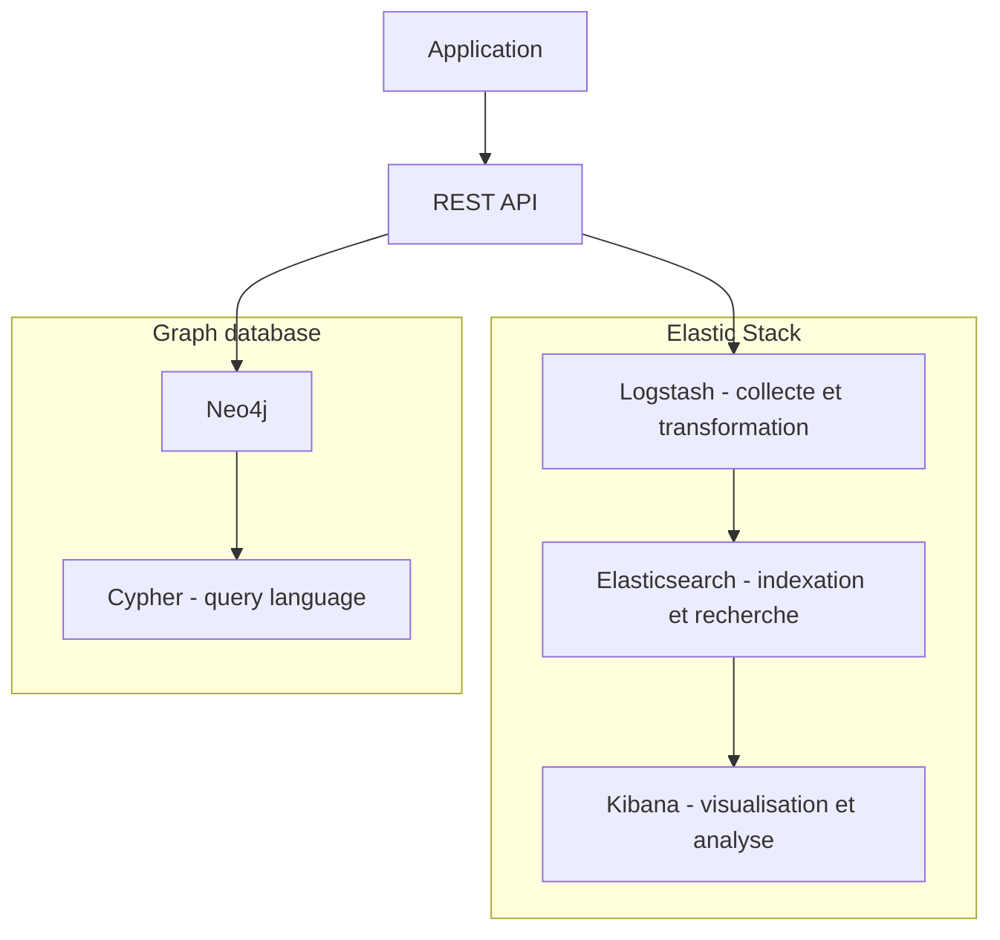
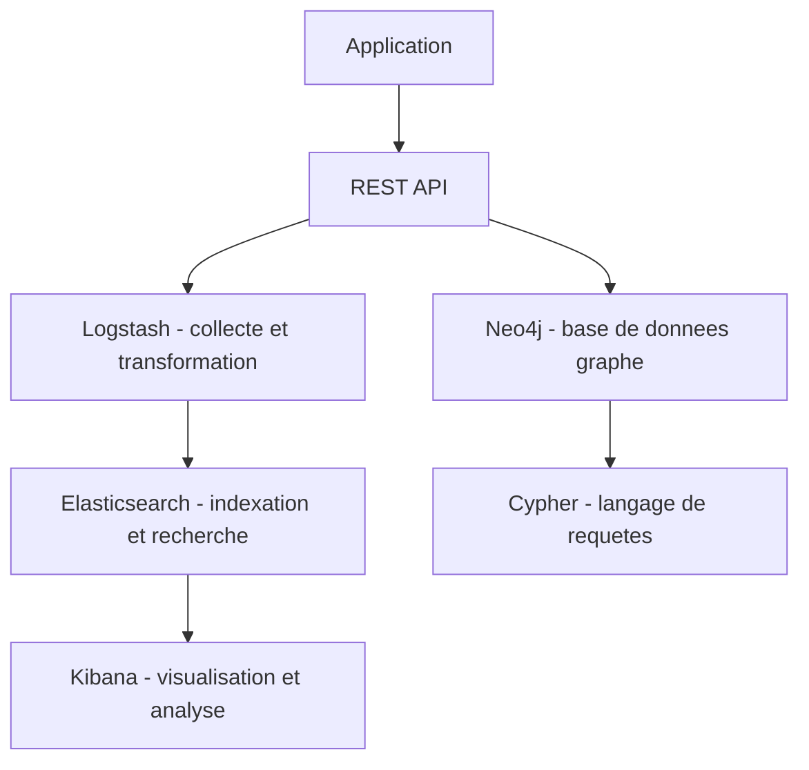
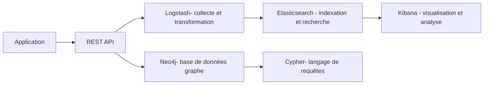
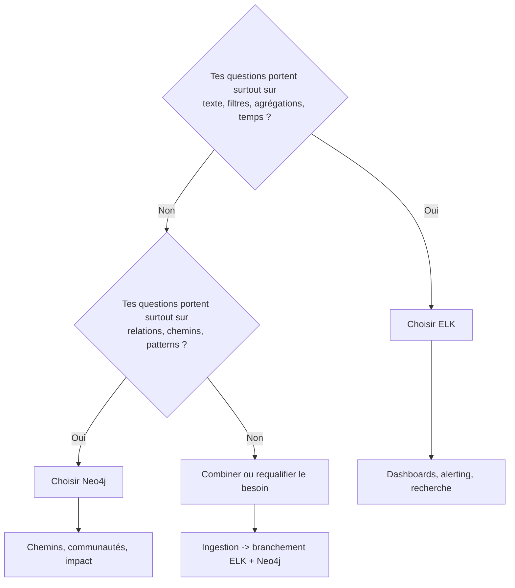

# Exemple d'intégraion Pipeline #1

Bonne question !

**ELK** est un acronyme qui désigne une **stack logicielle open-source** très utilisée pour la collecte, l’analyse et la visualisation de données, en particulier les **logs** :

* **E** = **Elasticsearch**

  * Le moteur de recherche et d’indexation distribué.
  * Sert à stocker, indexer et rechercher des données textuelles, numériques ou semi-structurées (par ex. des logs).

* **L** = **Logstash**

  * L’outil de collecte, traitement et transformation de données.
  * Il prend des données de différentes sources (fichiers, bases de données, APIs, etc.) et les envoie vers Elasticsearch.

* **K** = **Kibana**

  * L’interface de visualisation et d’analyse.
  * Permet de créer des tableaux de bord interactifs, des graphiques et des recherches sur les données stockées dans Elasticsearch.

-  Exemple d’utilisation :
Un système d’entreprise génère des **logs applicatifs** et des **événements système**.

* **Logstash** collecte ces logs, les nettoie et les transforme.
* **Elasticsearch** indexe les données pour les rendre consultables rapidement.
* **Kibana** permet aux développeurs, analystes ou équipes de sécurité d’explorer et de visualiser ces données en temps réel.

- Aujourd’hui, on parle aussi beaucoup de la **stack Elastic** (parfois **Elastic Stack**), qui inclut **ELK + Beats** (un autre composant pour collecter les données légères).


Je vous propose une représentation de la stack combinant **Elasticsearch**, **Logstash**, **Kibana** et **Neo4j** :

```plaintext
          +-------------------------------+
          |           Application         |
          +-------------------------------+
                        |
                        |
                        v
          +-------------------------------+
          |          REST API             |
          +-------------------------------+
                        |
          +-----------------+    +-----------------+
          |    Logstash    |    |      Neo4j      |
          +-----------------+    +-----------------+
                   |                       |
                   |                       |
                   v                       v
         +----------------+       +----------------+
         | Elasticsearch  |       |    Cypher      |
         | (Indexation    |       | (Langage de    |
         |  et Recherche) |       |  Requêtes)     |
         +----------------+       +----------------+
                    |
                    v
          +-------------------------------+
          |             Kibana            |
          | (Visualisation et Analyse)    |
          +-------------------------------+
```








# Explications de chaque composant :

- **Application** : Le logiciel ou l’interface que les utilisateurs utilisent pour interagir avec les données.
- **REST API** : Une interface permettant à l'application de communiquer avec Elasticsearch et Neo4j.
- **Logstash** : Un outil de collecte et de transformation de données, qui envoie ensuite les données à Elasticsearch.
- **Neo4j** : La base de données de graphe qui stocke et interroge les relations complexes entre les données via Cypher.
- **Elasticsearch** : Moteur de recherche pour l'indexation et la recherche de données textuelles et semi-structurées.
- **Cypher** : Langage de requête utilisé pour interroger la base de données Neo4j.
- **Kibana** : Outil de visualisation permettant d'afficher et d'analyser les données d’Elasticsearch.

Cette stack permet de gérer les données textuelles (via Elasticsearch) et relationnelles (via Neo4j) avec des visualisations dans Kibana pour une analyse efficace.

<br/>

# Annexe 1








# Annexe 2


* **ELK** → logs/événements volumineux, **recherche texte ultra-rapide**, **tableaux de bord** et agrégations temporelles.
* **Neo4j** → **relations et chemins** (qui dépend de quoi, qui est connecté à qui), **détection de patterns** dans un graphe.
* **Les deux** → quand tu as **à la fois** des métriques/logs (ELK) **et** des questions de **réseau/relations** (Neo4j).


# Quand ELK est le bon choix

**Objectif principal :** chercher vite et visualiser de gros volumes de données “à plat”.

* Logs applicatifs, traces, métriques, events **time-series**.
* **Recherche full-text**, filtres, facettes, tris.
* **Agrégations** (moyenne, somme, percentiles) sur de très gros volumes.
* **Dashboards** en temps réel, **alerting**, corrélation basique par champs.
* Besoin d’**ingestion multi-sources** + nettoyage → **Logstash/Beats**.
* Exemples : observabilité/SIEM, KPI métier en continu, analytics web, erreurs de prod.

**Signes que c’est ELK :**

* Tes questions ressemblent à “combien, quand, top N, tendance, taux d’erreur”.
* Tu scrolles/filtres des logs et construis des **graphiques** dans Kibana.
* Tes données sont **documents JSON** avec des timestamps.


# Quand Neo4j est le bon choix

**Objectif principal :** comprendre et interroger des **relations complexes**.

* Modéliser **un réseau** (personnes, services, dépendances, équipements).
* Questions de **chemin** / **voisinage** / **communautés** : “qui est à 2 sauts de… ?”, “quel chemin relie X à Y ?”.
* **Détection de motifs** (patterns) : fraude, recommandation, impact d’une panne.
* Exemples : cartographie d’architecture (microservices → dépendances), **BOM** logiciels, graphe de connaissances, IAM (qui a accès à quoi).

**Signes que c’est Neo4j :**

* Tes questions commencent par “**montre le lien entre…**”, “**trouve le chemin** le plus court”, “**quels voisins** partagés ?”.
* Tu veux **évoluer** le modèle par **relations** et **types de nœuds** sans souffrir de jointures lourdes.
* Tu écris des requêtes **Cypher** (patterns de graphes).


# Anti-patterns (à éviter)

* **Forcer Elasticsearch à faire du graphe** (chaînes de jointures ou “path” complexes) → douloureux et limité.
* **Indexer des logs dans Neo4j** pour faire des dashboards time-series → pas adapté; tu perdras en vitesse et en facilité de visu.


# Quand combiner ELK + Neo4j

**Cas fréquents en prod :**

* Tu ingères **une fois** → tu **branches** :

  * vers **Elasticsearch** pour recherche/agrégations/dashboards,
  * vers **Neo4j** pour modèles de **dépendances** et **analyses de chemins**.
* Exemples :

  * Observabilité **+** carte des dépendances microservices.
  * SIEM **+** graphe de relations entités-IP-machines-comptes pour enquêtes.
  * E-commerce : **logs de clics** (ELK) **+** **graphe produits-utilisateurs** (Neo4j) pour recommandations.


# Petit décideur visuel




# Grille rapide de décision

| Critère             | ELK                                 | Neo4j                                         |
| ------------------- | ----------------------------------- | --------------------------------------------- |
| **Type de données** | Documents JSON, logs, time-series   | Nœuds + arêtes (graphe)                       |
| **Questions clés**  | Combien, quand, top N, tendances    | Qui est relié à qui, quel chemin, communautés |
| **Latence/Volume**  | Très gros volumes, recherche rapide | Relations profondes, traversées efficaces     |
| **Visualisation**   | Kibana (dashboards/alerting)        | Outils graphes (Bloom) / requêtes Cypher      |
| **Modèle**          | Schéma souple par champs            | Schéma riche en relations                     |
| **Ingestion**       | Beats/Logstash natifs               | ETL vers nœuds + relations                    |


# Exemples concrets

* **Prod/Observabilité** : erreurs 5xx/min, latence P95, logs d’accès → **ELK**.
* **Dépendances microservices** : “si `auth` tombe, qui est impacté ?” → **Neo4j** (chemins).
* **Fraude** : “cartes, comptes et IP partagées en 3 sauts” → **Neo4j**.
* **Marketing web** : top pages, conversions par source → **ELK**.
* **Recommandations** : “utilisateurs qui ont acheté ensemble” → **Neo4j** (et tu peux afficher les résultats dans un dashboard ELK si tu veux un suivi).


